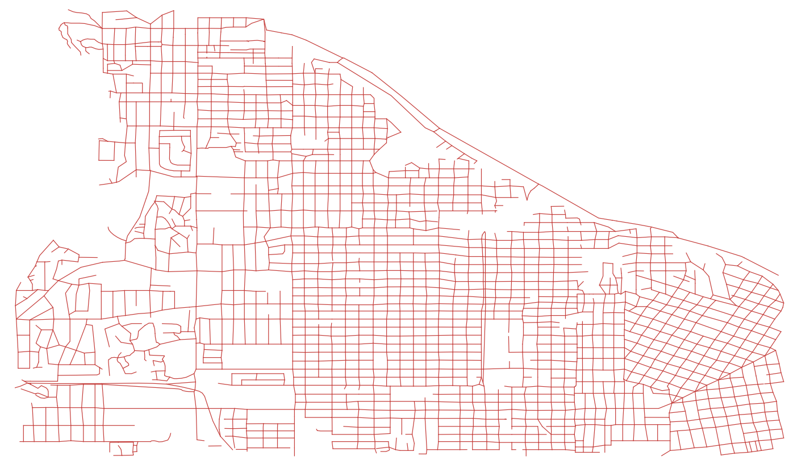
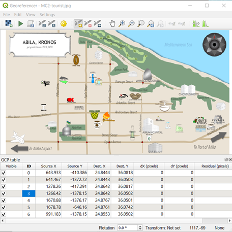
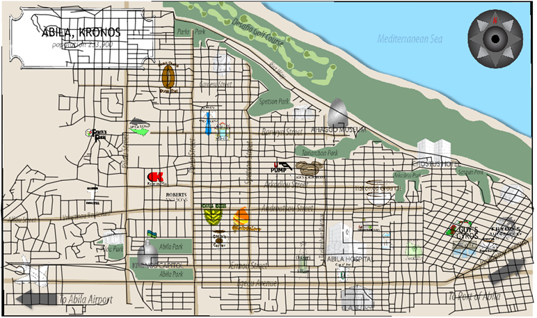

```{r setup, include=FALSE}
knitr::opts_chunk$set(echo = FALSE)
```

# VAST Challenge 2

# Content

* [1.0 Literature Review]

* [2.0 Insights]
    + [2.1 Credit Card and Loyalty Card Transactions]
        + [2.1.1 Loyalty Card Usage]
        + [2.1.2 Credit Card Usage]
    + [2.2 Visitor per location by day]
        + [2.2.1 Loyalty Card]
        + [2.2.2 Credit Card]
    + [2.3 Total Visits per Store]

* [3.0 Georeferencing]

* [4.0 Inferences]
    + [4.1 Merging Car and GPS Dataset]
    + [# 4.2 Finding Patterns from Patronage and Vehicle Data ]


* [5.0 Future Works]


# 1.0 Literature Review
For the literature review, a sample entry was taken from GitHub on a team who participated in the VAST Challenge 2014, Mini Challenge 2. The team of two was from City University London who performed their analysis using processing and libraries giCentre Utils and geoMap which were written by the giCentre at City University London.

The team used a map to indicate the coordinates of each vehicle at any point in time using animation. Locations outside of the norm were highlighted to find that there were five unknown locations visited by four security employees.

A possible gap to the for this study would be to identify the credit card owners by inferencing the vehicle dataset with the credit card dataset.


```{r}
# Install Required Packages

packages = c('DT','ggiraph','plotly','tidyverse', 'igraph','tidygraph','ggraph', 'sf',
             'visNetwork','lubridate','clock',
             'raster','tmap','clock','st','readr','mapview','ggpubr','greekLetters','widyr','tibble' )


for (p in packages){
  if(!require(p,character.only = T)){
    install.packages(p)
  }
  library(p,character.only = T)
}
```


```{r}
# Import Data

car <- read_csv("data/car-assignments.csv")
gps <- read_csv("data/gps.csv")
credit_card <- read_csv("data/cc_data.csv")
loyalty <- read_csv("data/loyalty_data.csv")

```


```{r}
#Clean Credit Card and Loyalty Card Data

#Credit card
credit_card$last4ccnum <- as.character(credit_card$last4ccnum)

credit_card$timestamp <- date_time_parse(credit_card$timestamp,
                                 zone = "",
                                 format = "%m/%d/%Y %H:%M")

#Loyalty Card
loyalty$timestamp <- date_time_parse(loyalty$timestamp,
                                 zone = "",
                                 format = "%m/%d/%Y")
```

# 2.0 Insights

## 2.1 Credit Card and Loyalty Card Transactions 

Using the loyalty card and credit card data, we first explore the popularity of shops by counting the number of visits by location.
It was found that Katerina's Cafe and Hippokampos were the top 2 most popular shops in terms of the transactions made over the period from 6 Jan to 19 Jan 2014.


### 2.1.1 Loyalty Card Usage

```{r}
#Loyalty Card usage total represented by Loyalty use variable
loyaltyuse <- loyalty %>%
  group_by(location) %>%
  summarize(timesvisit = length(loyaltynum))

loyaltyuse$location=str_replace_all(loyaltyuse$location,"[^[:graph:]]", " ") 

popular_loyalty <- ggplot(loyaltyuse, aes(y = location, x = timesvisit, color = timesvisit)) + geom_point_interactive(aes(tooltip = timesvisit))

girafe(ggobj = popular_loyalty,width_svg = 6,height_svg = 6*0.618)

```

### 2.1.2 Credit Card Usage

```{r}
#credit Card usage total represented by Loyaltyuse variable
ccuse <- credit_card %>%
  group_by(location) %>%
  summarize(timesvisit = length(last4ccnum))

ccuse$location=str_replace_all(ccuse$location,"[^[:graph:]]", " ") 

popular_cc <- ggplot(ccuse, aes(y = location, x = timesvisit, color = timesvisit)) + geom_point_interactive(aes(tooltip = timesvisit))

girafe(ggobj = popular_cc,width_svg = 6,height_svg = 6*0.618)

```

## 2.2 Visitor per location by day

Next, we next plot the visitor count by day for each location to identify possible trends.
It was also observed that at least 10 vehicles will visit Brew've Been Served every weekday.

On the credit card data, it was noticed that there was 1 visit to the Daily Dealz and 1 visit to U-pump which were out of the normal pattern. The visit to the Daily Dealz was not captured in the loyalty data, hence it can be inferred that the loyalty card might not be applicable for that store.


The data on loyalty card usage collects the date used but not the time, hence it is recommended that the time be collected as well to correctly match the credit card owner and the loyalty card owner to identify the card user.


### 2.2.1 Loyalty Card

```{r}
#Loyalty Card usage by day 
loyaltyday <- loyalty %>%
  group_by(timestamp,location) %>%
  summarize(timesvisit = length(loyaltynum))

loyaltyday$location=str_replace_all(loyaltyday$location,"[^[:graph:]]", " ") 

p <- ggplot(loyaltyday, aes(y = location, x = timestamp, color = timesvisit)) + geom_point_interactive(aes(tooltip = timesvisit))

girafe(ggobj = p,width_svg = 6,height_svg = 6*0.618)

```

### 2.2.2 Credit Card

```{r}
#Credit Card usage by day

#Remove time from timestamp and keep date
credit_card$date <- as_date(credit_card$timestamp)

ccday <- credit_card %>%
  group_by(date,location) %>%
  summarize(timesvisit = length(last4ccnum))


ccday$date <- as.Date(ccday$date)


ccday$location=str_replace_all(ccday$location,"[^[:graph:]]", " ") 

q <- ggplot(ccday, aes(y = location, x = date, color = timesvisit)) + geom_point_interactive(aes(tooltip = timesvisit))
  
girafe(ggobj = q,width_svg = 6,height_svg = 6*0.618)

```


Next we look at merging the credit card data with the loyalty card data to identify their relationship.As the exact transaction time was not recorded for the loyalty card, we draw relationship between the credit card and the loyalty card using the date, location and price variables. 
The left-join method was applied as payment is assumed compulsory by credit card for each transaction while the use of a loyalty card is optional, hence there might be credit card transactions without the use of a loyalty card which was apparent in the chart above as there were more visits recorded for the credit card data when compared to the loyalty card data.
The credit card number should also be consistent with the loyalty card number as both should belong to the same owner.


```{r}
#Left Join Loyalty Card transactions to credit card
patronage <- credit_card %>%
  left_join(loyalty, by = c("date" = "timestamp", "location" = "location", "price" = "price"))

```

```{r}
#Splitting the date time into date, hours and minute
patronage$date <- as_date(patronage$timestamp)
patronage$hour <- hour(patronage$timestamp)
patronage$minute <- minute(patronage$timestamp)


```

```{r}
#ShopTrans will be used to plot the paronage by locations 
ShopTrans <- patronage
ShopTrans$location <- as_factor(ShopTrans$location)
```

```{r}
ShopTrans <- patronage %>%
  #filter(date == "2014-01-07") %>%
  group_by(location) %>%
  summarize(timesvisit = length(last4ccnum))

ShopTrans$location=str_replace_all(ShopTrans$location,"[^[:graph:]]", " ") 

```
The data was grouped by location in which Katerina's Cafe was found the be the most popular location with 214 visitors, followed by Hippokampos with 173 visitors.

This was an anomaly as the credit card data only showed 212 visitors for Katerina's Cafe and 171 for Hippokampos.


## 2.3 Total Visits per Store

```{r}
s <- ggplot(ShopTrans, aes(y = location, x = timesvisit, color = timesvisit)) + geom_point_interactive(aes(tooltip = timesvisit)) #+ facet_grid("hour")
  
girafe(ggobj = s,width_svg = 6,height_svg = 6*0.618)

```

To address the anomaly, we compare the Patronage dataset with the credit card data.
We filter the transactions which were made using a credit card and loyalty card to identify the cause of the anomaly.


In this regard, we found that several credit card transactions had more than 1 loyalty card applied. We see that credit card numbers 1286,4795,4948,5368,5921,7889 and 8332 made transactions with more than 1 loyalty card.

This could imply that there was a meet-up between different employees of GasTech at those locations where a colleague might have used his loyalty card to obtain the benefits from the store.

```{r}
#Identify the credit cards with more than 1 loyalty card

dup <- patronage %>%
  filter(is.na(loyaltynum)==0) %>%
  group_by(last4ccnum,loyaltynum) %>%
  summarise(n = length(unique(loyaltynum)))

dup2 <- dup %>%
  group_by(unique(last4ccnum))%>%
  summarise(UniqueLoyalty = length(loyaltynum))%>%
  filter(UniqueLoyalty>1)
  
dup2
```

Using the interactive datatable, we could identify the transactions made with the above credit card numbers. It was found that the occurrences of using a different loyalty card were more than one.

```{r}
#Insert Interactive Data Table
#Upon joining the data, an attempted was made to create a DT data table using the to explore the dataset. However, an error was found as there were invalid symbols found in the data. 
#To address the issue, greeks() function could be aplied, but the result was the first word for each location. Thus, a regular expression was used to filter out none alphabets.

#patronage$locationgreek <- greeks(patronage$location)
#DT::datatable(patronage)


patronage$location <- str_extract(patronage$location, regex("[:alpha:]*[:space:]*[:alpha:]*"))
DT::datatable(patronage)
```


# 3.0 Georeferencing

For the Mini Challenge, we were given a jpg file of the Akila, Kronos Map which we would use as the background for the locations. To use the geospatial data, we will need to georeference the points on the map image using GIF softwares such as QGIS. 
For this assignment, the QGIS software was used and to map the points of the shape file to the image file.

First, we were given the Abila.shp file which contained the map information which could be opened in the QGIS application as shown below.



Next, to make the map useful, we merge the map data to the given image data using *georeferencer* to indicate the points on the map to the coordinates on the image.



Finally, we apply the georeference to get the final output as shwon below.



```{r}
# Setting the Map as Background
bgmap <- raster("data/MC2-tourist_modified.tif")

tmap_mode("plot")
tm_shape(bgmap) + tm_raster(bgmap, legend.show = FALSE)

tm_shape(bgmap) +
tm_rgb(bgmap, r = 1, g = 2, b = 3,
       alpha = NA,
       saturation = 1,
       interpolate = TRUE,
       max.value = 255)
```

```{r}
#Importing Abila Shape file into R
Abila_st <- st_read(dsn = "data/Geospatial", layer = "Abila")

```


# 4.0 Inferences

## 4.1 Merging Car and GPS Dataset

Next, we merge the gps and car datasets to which contains the vehicle data to identify owners and the trips made by each vehicle during the period between 6 Jan 2014 and 19 Jan 2014.

```{r}
#merging gps with car
vehicle <- gps %>%
  left_join(car, by = c("id" = "CarID"))
```

```{r}
vehicle$Timestamp <- date_time_parse(vehicle$Timestamp,
                                 zone = "",
                                 format = "%m/%d/%Y %H:%M:%S")

#Convert cars ID into Scalar Data-Type as each ID represents a vehicle
vehicle$id <- as_factor(vehicle$id)

```

```{r}
#Splitting Timestamp from vehicle into hours and minutes

vehicle$date <- as_date(vehicle$Timestamp)
vehicle$hour <- hour(vehicle$Timestamp)
vehicle$minute <- minute(vehicle$Timestamp)

```

We are interested to know which employee visited the shops and made those transactions, however, available information on both datasets are very limited as we only have the timestamp to possibly match the vehicle dataset with the patronage dataset. Even the credit card dataset could only record to the minute, while gps data had a higher resolution to the second.


```{r}
#Merging Vehicle data with card data to determine location

ShopPath <- vehicle %>%
  left_join(patronage, by = c("date" = "date", "hour" = "hour", "minute" = "minute"), suffix =c("_patron", "_vehicle"))

```

```{r}
#Correcting Timestamp
#ShopPath$Timestamp <- date_time_parse(ShopPath$Timestamp,
 #                                zone = "",
 #                                format = "%m/%d/%Y %H:%M:%S")
```


```{r}
#Simple Frame for vehicle data
ShopPath_sf <- st_as_sf(ShopPath,
                   coords = c("long", "lat"),
                   crs = 4326)
```


```{r}
Trips <- ShopPath_sf %>%
  group_by(date,id,hour,minute,location,last4ccnum,loyaltynum,FirstName,LastName,CurrentEmploymentType,CurrentEmploymentTitle) %>%
  summarise(mtime = mean(Timestamp),do_union = FALSE) %>%
  st_cast("LINESTRING")

```


```{r} 
#Remove single coordinates so that a line can be drawn
r = mapview::npts(Trips, by_feature = TRUE)
Trips <- cbind(Trips, r) %>%
  filter(r>"1")

```

We start off by plotting the route taken by each employee for each day.


```{r}
#Drawing the path for all vehicles on 13 Jan
#Path 3 groups all the data by date + id

gps_path_selected <- Trips %>%
  filter(date == "2014-01-13" & r > "1")
tmap_mode("view")
tm_shape(bgmap) +
  tm_rgb(bgmap, r = 1,g = 2,b = 3,
       alpha = NA,
       saturation = 1,
       interpolate = TRUE,
       max.value = 255) +
  tm_shape(gps_path_selected) +
  tm_lines("id")
```


```{r}
#Convert cars ID into Scalar Data-Type as each ID represents a vehicle
vehicle$id <- as_factor(vehicle$id)

```

```{r}
#Simple Frame for GPS data
vehicle_sf <- st_as_sf(vehicle,
                   coords = c("long", "lat"),
                   crs = 4326)
```


```{r}
#Setting the path using lines
vehicle_path <- vehicle_sf %>%
  group_by(id) %>%
  summarise(m = mean(Timestamp),
            do_union=FALSE) %>%
  st_cast("LINESTRING")

```

```{r}
#Creating a separate vehicle path by splitting the timestamp

vehicle_sf$date <- as_date(vehicle_sf$Timestamp)
vehicle_sf$hour <- hour(vehicle_sf$Timestamp)
vehicle_sf$minute <- minute(vehicle_sf$Timestamp)

```

```{r}
#Data by date
vehicle_path_date <- vehicle_sf %>%
  group_by(id,date) %>%
  summarise(m = mean(Timestamp),
            do_union=FALSE) %>%
  st_cast("LINESTRING")

```


```{r}
#Data by hour
vehicle_path_hour <- vehicle_sf %>%
  group_by(id,date,hour) %>%
  summarise(m = mean(Timestamp),
            do_union=FALSE) %>%
  st_cast("LINESTRING")

```

```{r} 
#Remove single coordinates so that a line can be drawn for path data by date
r = mapview::npts(vehicle_path_date, by_feature = TRUE)
vehicle_path_date <- cbind(vehicle_path_date, r)

```

```{r}
#Plotiing the paths by id. due to the Distill not showing the facets clearly, its better if the lines be colored instead.

vehicle_path_selected <- vehicle_path_date %>%
  filter(date == "2014-01-06" & r > "1")
tmap_mode("view")
tm_shape(bgmap) +
  tm_rgb(bgmap, r = 1,g = 2,b = 3,
       alpha = NA,
       saturation = 1,
       interpolate = TRUE,
       max.value = 255) +
  tm_shape(gps_path_selected) +
  tm_lines("id")

```


```{r}
#Vehicle Path by employment type
jobtitle_path <- vehicle_sf %>%
  group_by(id,CurrentEmploymentTitle,CurrentEmploymentType,date,hour,minute) %>%
  summarise(m = mean(Timestamp),
            do_union=FALSE) %>%
  st_cast("LINESTRING")

```

```{r} 
#Remove single coordinates so that a line can be drawn for path data by date
r = mapview::npts(jobtitle_path, by_feature = TRUE)
jobtitle_path <- cbind(jobtitle_path, r)

```

When we group the vehicle data by employment title, we could determine the normal route which each employee would take. From the chart below, we could see the following "unique" paths taken which were out of the norm. These paths can be identified by the weight of the lines which represents the frequency in which the path was taken.

```{r}
#plotting the path by Employment Title to identify outliers

path_selected <- jobtitle_path %>%
  filter(r > "1")
tmap_mode("view")
tm_shape(bgmap) +
  tm_rgb(bgmap, r = 1,g = 2,b = 3,
       alpha = NA,
       saturation = 1,
       interpolate = TRUE,
       max.value = 255) +
  tm_shape(path_selected) +
  tm_lines(by = "id") #+
 # tm_facets(by = "CurrentEmploymentTitle")

```

S/N | ID     | Current Employment Title| Remarks
----|--------|-----------------------| ----------------------------
1   | 22     | Badging Office               | 1 Trip through Ermou Street
2   | 20     | Building Control             | 1 Trip through coffee Chameleon
3   | 26     | Drill Site Manager           | 1 trip through Androutsu Street and 1 trip around Carnero Street
4   | 28     | Drill Technician             | For id 28, data is not usable. For id 7, there was a trip near Spetson Street
5   | 3  |  Engineer                    | 1 trip near Pilau Street
6   | 14    | Engineering Group Manager    | 1 trip aound Carnero Street
7   | 35  |  Environmental Safety Adviser | 1 trip near Parla Street and 1 trip near Arkadiou Street
8   | 29 |  Facilities Group Manager  | 1 trip past Hallowed Grounds and 1 trip past Carlyle Chemical Inc.
9   | 25 | Geologist | 1 trip past Alberts Fine Clothing
10 | 19 | Hydraulic Technician | 1 trip past Coffee Shack


When we look at the pathings by Employment Type, we see a different picture. As observed below, the Employment Type "Missing", which represents trucks (as identified with id > 100), showed a peculiar route taken. Vehicle *ID 107* could be seen travelling pass Pilau Park to Velestinou Boulevard.
Vehicle *ID 29* from Facilities could also be seen travelling to unique places during the period.

```{r}

#Plotting ppath by Employment Type
path_selected2 <- jobtitle_path %>%
  filter(r > "1")
tmap_mode("view")
tm_shape(bgmap) +
  tm_rgb(bgmap, r = 1,g = 2,b = 3,
       alpha = NA,
       saturation = 1,
       interpolate = TRUE,
       max.value = 255) +
  tm_shape(path_selected2) +
  tm_lines(by = "id") +
  tm_facets(by = "CurrentEmploymentType")

```


## 4.2 Finding Patterns from Patronage and Vehicle Data 

Next, we'll try and identify the possible owners of the credit card and loyalty card by filtering the location by date and time.
For the below charts, we filter the vehicle data to show the vehicle locations by hour, specifically on 6 Jan 2014.
The method applied was to identify the vehicle id which was present in on the map on a specific hour and cross-reference it to the paronage dataset to identify the credit card transaction made as well as the location.


```{r}

#Plotting path on 6 Jan
path_selected_date <- jobtitle_path %>%
  filter(r > "1" & date == "2014-01-15")
tmap_mode("view")
tm_shape(bgmap) +
  tm_rgb(bgmap, r = 1,g = 2,b = 3,
       alpha = NA,
       saturation = 1,
       interpolate = TRUE,
       max.value = 255) +
  tm_shape(path_selected_date) +
  tm_lines(by = c("id","hour")) #+
 # tm_facets(by = "hour")

#patronage %>%
#  filter(date ="2014-01-13")

```

```{r}
patronage$location <- str_extract(patronage$location, regex("[:alpha:]*[:space:]*[:alpha:]*"))
DT::datatable(patronage)

```

### Isolated credit card transactions

The below observations using isolated cases could be made using the data from 6 Jan 14:


time (hr) |Vehicle ID | Location | last4ccnum
-----|-------|----------|------
9  | 101 | Kronos Pipe |  9220
10 |101 | Maximum Iron |  9220
10 | 107 | Nationwide Refinery |  9735
15  |104 | Abila Airport | 8642
20 | 19 | Shoppers | 7688


The steps above was repeated for all dates to obtain the below list of identified vehicle id, tagged to a credit card number. The rest of the data was not complete as during the process, several of the credit cards were found to be used at a shop where a different vehicle was driven instead. hence the echnique was found to be lacking in terms of the accuracy.


Vehicle ID | last4ccnum
-------|-------
1 | 2681
10 | 1321
12 | 2418
13 |9735
14 | 5368
 19 |  7688
 21 | 8156
 24 | 9152 1877
 32 | 7688
 34 | 2681
35 | 9551
101 |   9220
104 |  8642
105 | 7792
107 |   9735
 

# 5.0 Future Works

As part of the future work, the network visualisation could be explored to match the credit card transactions to the vehicle id to identify the owners.


